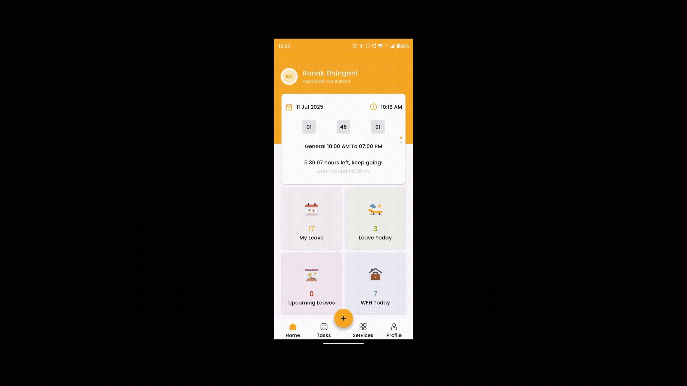

# 📱 Portal App - Flutter

Welcome to the ** Portal App** built using Flutter. This app serves as a comprehensive, all-in-one solution for employee management, daily tasks, and communication. It is designed to streamline operations for teams, especially those working remotely or in hybrid setups.

---

## 🌟 Features Overview

This portal offers various modules aimed at employees and team leaders (TLs) to handle daily workflows, requests, and reports.

### 🔐 Login Screen 

* Secure sign-in using email/password.
* Prevents unauthorized access.
* Smooth user authentication and validation.

---

### 🏠 Home Screen

* Quick navigation to all major modules.
* Displays brief stats (e.g., today's task, EOD submitted or not).
* Role-based content visibility (Employee vs TL).

---

### 📋 Task Dashboard

* Add new tasks with status: Pending, In Progress, Completed.
* View running tasks and task history.
* Assign tasks to self or team members.
* Submit end-of-day summaries.

---

### 🧳 Leave & WFH Management

* Employees can apply for **Leave** or **Work From Home**.
* TLs can approve/reject requests.
* View past and upcoming leave/WFH status.

---

### 🧑‍💼 Profile Screen

Menu options for:
 * Viewing and editing profile details.
 * Changing account password.
 * Setting and updating profile wallpaper.

---

### 🔄 Switch Account / Add Account

* Easily switch between multiple accounts.
* Add a new account without logging out.
* Useful for users managing multiple roles.

---

### 🔐 Change Password

* Secure interface to change login credentials.
* Enforces strong password validation.

---

### 🛠️ Services Screen

* Displays available internal services like:

  * Leave
  * WFH
  * Holidays 
  * Policies
  * Project 
  * Task Dashboard
  * Time Entry
  * Venue Booking

---

## 🔒 Role-Based Features

* **Employee**

  * Submit tasks & EOD
  * Apply for leave/WFH
  * View own requests

* **Team Leader (TL)**

  * Approve/Reject leave/WFH
  * Monitor team tasks & EODs

---

### 📅 Holidays

* View upcoming company holidays.
* Stay updated with leave planning.
* Public and internal events calendar support.

---

### 📜 Policies

* Access company-wide policy documents.
* Downloadable and categorized files (HR, IT, General).
* Regular updates and version history.

---

### 🏢 Venue Booking

* Book meeting rooms and game zone slots.
* Choose from available time slots.
* Receive confirmation and reminders.
* Manage your upcoming bookings easily.

---

## 📽️ App Demo Video

> 

---


## 📂 Folder Structure (Simplified)

```
lib/
├── main.dart
├── routes/
├── common_widget/
├── controller/
├── model/
├── screen/
│   ├── login/
│   ├── home/
│   ├── task/
│   ├── leave/
│   ├── wfh/
│   ├── services/
│   ├── profile/
├── widgets/
├── utils/
assets/
├── images/
├── lotties/
├── quotes/
├── sounds/
```

---

## 🛠️ Tech Stack

* **Flutter** (3.x)
* **Firebase** (Authentication, Firestore)
* **GetX** (for state management)

---

## 📘 Related Repository

For a complete guide on setting up Flutter on Linux, Windows, or macOS, visit the  
[Flutter Setup Guide Repository](https://github.com/RonakDhingani/Flutter-Setup-Guide).

---

## 📧 Contact / Feedback

If you’d like to suggest a feature or report a bug, please open an issue or email me at [ronakdhingani2000@gmail.com](mailto:ronakdhingani2000@gmail.com).

---

Thank you for checking out the **Portal App**. Let’s build better teams together! 💼🚀

